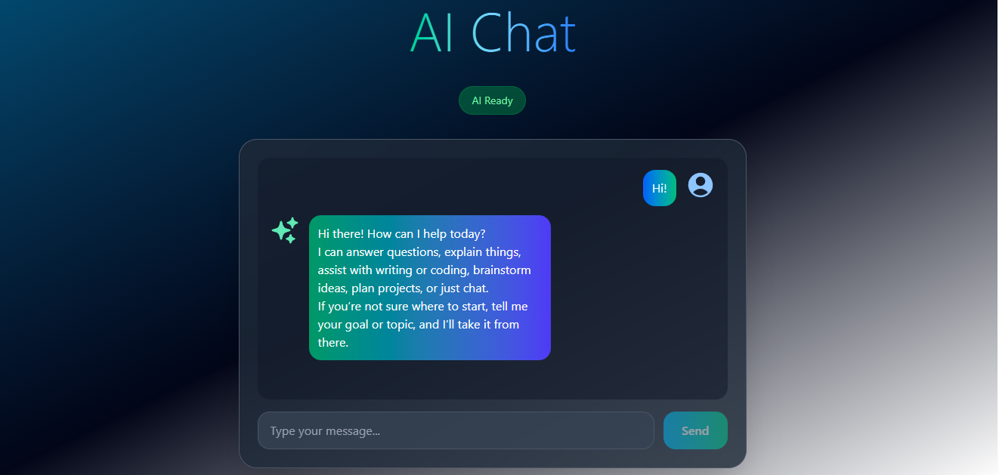

AI Chat Application

A modern and responsive AI-powered chat interface built with React, Vite, TailwindCSS, and Puter AI.
Designed with clean architecture, smooth UI/UX, and real-time AI responses.

📸 Screenshot

🚀 Features

Real-time conversation powered by Puter AI

Beautiful, professional UI styled with TailwindCSS v4

Smooth user & AI chat bubbles with gradient design

Auto-scroll, loading indicator, and status detection

Fast and optimized Vite development environment

Fully responsive design (mobile → large screens)

🛠️ Tech Stack

React 19

Vite 7

TailwindCSS 4

Puter AI

PostCSS & Autoprefixer

ESLint

📦 Installation
npm install
npm run dev

Open:

http://localhost:5173

🤖 AI Integration Example
const reply = await window.puter.ai.chat(message);

📁 Project Structure
src/
App.jsx # Main application logic
index.css # Tailwind styles
main.jsx # Entry point

👩‍💻 Author

Era Hidaj
Frontend Engineer & Full-Stack Developer
