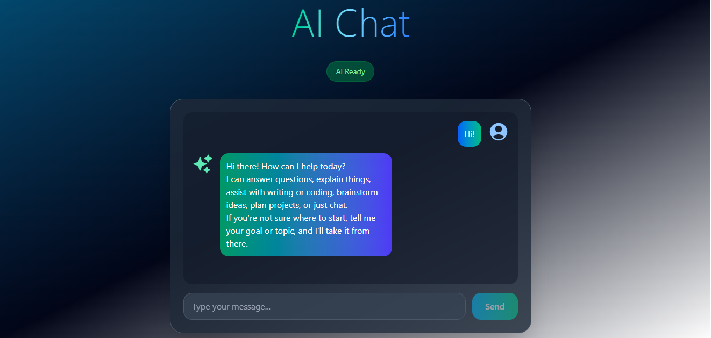

<h1>AI Chat Application</h1>

A modern, scalable, and high-performance AI chat application built with
<strong>React</strong>, <strong>Vite</strong>, and <strong>TailwindCSS</strong>,
featuring real-time AI interactions powered by <strong>Puter AI</strong>.

This project demonstrates professional frontend architecture, clean UI/UX
principles, and production-ready code quality.

<h2>📸 Preview</h2>

<h2>🚀 Features</h2>

<ul>
  <li>Real-time AI-powered conversations using Puter AI</li>
  <li>Elegant and responsive UI built with TailwindCSS v4</li>
  <li>Smooth chat bubbles with gradient styling</li>
  <li>Auto-scroll behavior and loading state handling</li>
  <li>Fast and optimized Vite development environment</li>
  <li>Fully responsive design (mobile → large screens)</li>
  <li>Clean and maintainable code structure</li>
</ul>

<h2>🛠️ Tech Stack</h2>

<ul>
  <li><strong>React 19</strong> – Component-based UI architecture</li>
  <li><strong>Vite 7</strong> – Lightning-fast development & optimized builds</li>
  <li><strong>TailwindCSS 4</strong> – Modern utility-first styling</li>
  <li><strong>Puter AI</strong> – AI-powered chat engine</li>
  <li><strong>PostCSS & Autoprefixer</strong> – CSS processing</li>
  <li><strong>ESLint</strong> – Code quality and consistency</li>
</ul>

<h2>📦 Installation</h2>

Clone the repository and install dependencies:

<pre><code>npm install
npm run dev</code></pre>

Open in browser:

<pre><code>http://localhost:5173</code></pre>

<h2>🤖 AI Integration</h2>

Example of AI request handling:

<pre><code>const reply = await window.puter.ai.chat(message);</code></pre>

The AI integration layer is designed to be easily replaceable with other providers.

<h2>📁 Project Structure</h2>

<pre><code>public/
 └── screenshot.png

src/
 ├── App.jsx        # Core application logic
 ├── main.jsx       # Application entry point
 └── index.css      # TailwindCSS styles
</code></pre>

<h2>🧠 Architecture Highlights</h2>

<ul>
  <li>Separation of concerns between UI and logic</li>
  <li>Predictable state management</li>
  <li>Reusable UI components</li>
  <li>Optimized rendering performance</li>
  <li>Maintainable styling system</li>
</ul>

<h2>👩‍💻 Author</h2>

<strong>Era Hidaj</strong> 

<h2>📌 Project Purpose</h2>

This project is built as a <strong>portfolio-grade application</strong> to demonstrate
frontend engineering skills, AI integration, and modern UI development practices.

<h2>🔮 Future Improvements</h2>

<ul>
  <li>User authentication</li>
  <li>Conversation history storage</li>
  <li>Theme switcher (dark/light mode)</li>
  <li>Multi-AI provider support</li>
  <li>Markdown message rendering</li>
</ul>

